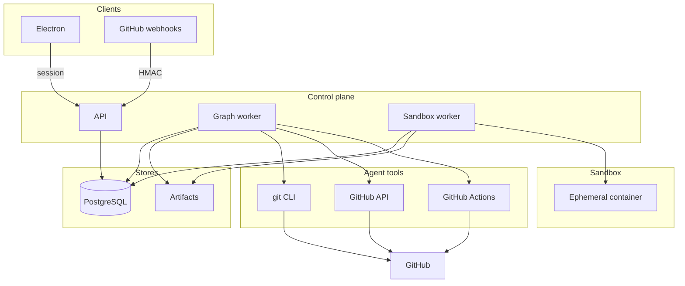
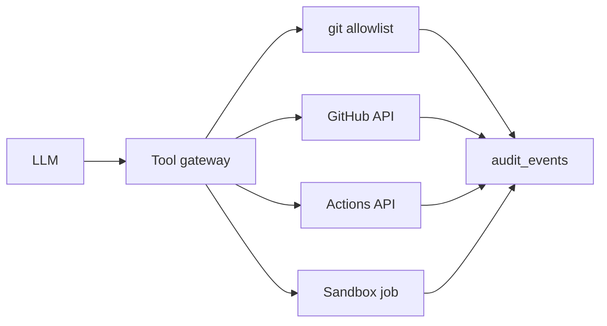
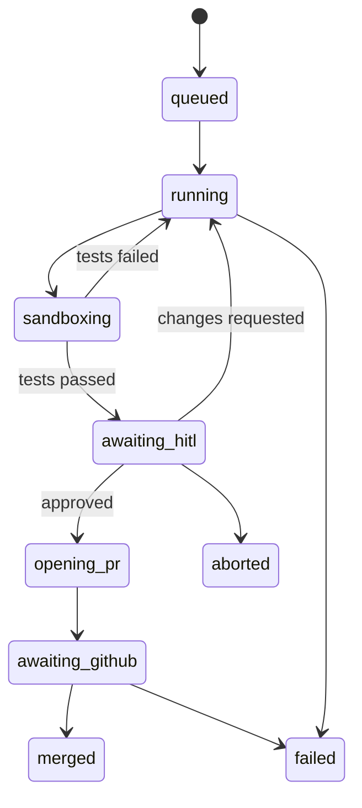
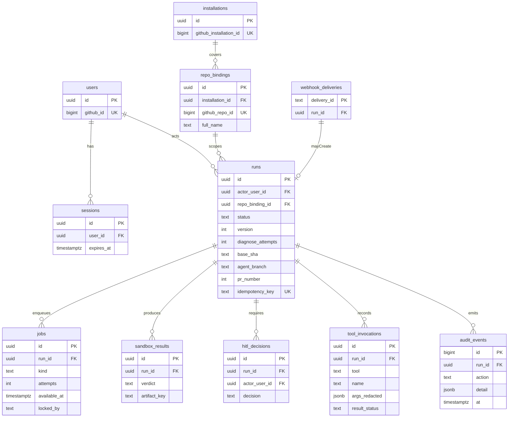
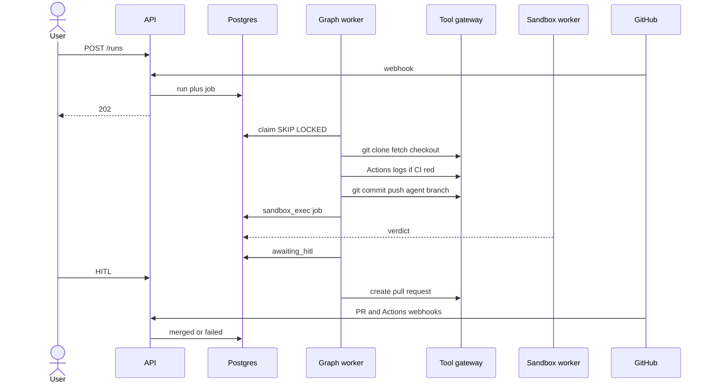

# Architecture

Adamant repairs a repository on a working branch, proves the change in a
sealed container, waits for a human, then opens a pull request. GitHub merges
it. The agent does not.

Electron is a client. PostgreSQL holds Adamant state. GitHub holds git objects,
checks, and merge policy (`adamant-protocols`).



The API authenticates, accepts commands, and ACKs webhooks. It does not run
models or Docker. Workers pull jobs with `FOR UPDATE SKIP LOCKED`.

## Identity

| Principal | Purpose |
| --- | --- |
| User OAuth session | Who clicked heal / HITL |
| GitHub App installation | What the agent may do on a repo |

A run is allowed only if the session user can access a repo bound to that
installation. Installation tokens are minted per call. They are not stored in
Electron, checkpoints, prompts, or the sandbox.

## Agent tools

LangGraph calls **tools**, not raw `child_process` from the model. Every
invocation is allowlisted, logged on `audit_events`, and attributed to
`run_id`. Unknown commands fail closed.

### git (graph worker)

Runs on the graph worker against a per-run worktree. Credentials are provided
through a one-shot `GIT_ASKPASS` helper, then discarded.

Allowed:

- `git fetch`, `git checkout`, `git switch -c`
- `git status`, `git diff`, `git log`, `git show`, `git rev-parse`
- `git add`, `git commit`, `git push` (agent branch only)

Denied: `push` to the default branch, `push --force`, `reset --hard` of
protected refs, `filter-branch` / `rebase` onto default, credential helpers,
`submodule` from untrusted URLs.

Push refspec is computed by the adapter (`refs/heads/adamant/{run_id}`), not
taken from the model.

### GitHub API

REST/GraphQL through the App. Typical tools: contents, compare, commits,
issues, pull requests, review comments, check runs, files changed.

Denied: merge, delete branch on default, admin/ruleset edits, token minting,
anything outside the bound `repo_id`.

### GitHub Actions

Used to **read and wait**, not to replace the sandbox.

| Tool | Use |
| --- | --- |
| `list_workflow_runs` | CI on the agent branch / PR |
| `get_workflow_run` / jobs / logs | Diagnose a red build |
| `rerun_failed_jobs` | After a patch |
| `workflow_dispatch` | Only workflows tagged `adamant-allowed` in repo settings we store |

Actions is CI evidence. Local sandbox is still required before HITL: GitHub
runners are not under our isolation policy.

### git in the sandbox

The container gets a detached worktree with remotes and credentials stripped.
It may run `git diff` / `git log` for tests that shell out to git. It cannot
`push`, `fetch`, or see `GIT_ASKPASS`.



## Run state



`merged` is copied from GitHub (`pull_request.closed`). The agent never merges.

HITL without a passing `sandbox_results` row is rejected.

## Graph

```mermaid
flowchart TD
  retrieve[Clone and inspect with git and API] --> diagnose[Diagnose including Actions logs]
  diagnose --> plan[Plan]
  plan --> patch[Commit and push agent branch]
  patch --> sandbox[Sandbox]
  sandbox --> diagnose: fail retries left
  sandbox --> hitl[HITL interrupt]
  hitl --> patch: request_changes
  hitl --> openPr[Open PR]
  hitl --> stop[Abort]
  openPr --> observe[Watch Actions and checks]
```

`diagnose_attempts` is capped on the run.

## Data



- `jobs.kind`: `graph_step` | `sandbox_exec`
- LangGraph checkpoints live in library tables, `thread_id = run_id`
- `runs.idempotency_key`: `webhook:{delivery_id}` or client `Idempotency-Key`
- Tool args are redacted before persist (no tokens, no `Authorization`)

## Heal path



## Sandbox

Host clones, strips remotes and credentials, then starts the container.

- network off during tests (registry allowlist only for install)
- no `docker.sock`, dropped caps, memory/CPU/PID/time limits
- one container per job, destroyed on exit
- logs go to the artifact store; `verdict` is `pass` or `fail`

## Failure

| Case | What happens |
| --- | --- |
| Duplicate webhook | `delivery_id` PK, ACK, no second run |
| Worker death | lock TTL; resume checkpoint |
| git/API 403 | fail the run; do not retry from the sandbox |
| Actions timeout | treat as fail evidence; sandbox still required |
| HITL TTL | `aborted`; leave the agent branch |
| Optimistic HITL | `runs.version` mismatch → 409 |

## Ruleset

[`adamant-protocols.json`](../adamant-protocols.json) is active but
`conditions.ref_name.include` is empty, so it currently matches no branches.
Set include to `~DEFAULT_BRANCH` before relying on it for `main`.
